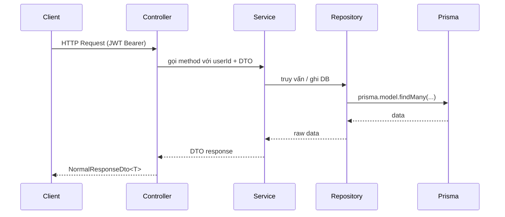

# Technical Design: [Tên Feature]

## 1. Sequence Flow



> Thêm bước `PrismaUnitOfWorkService` nếu có nhiều write cần transaction.

## 2. Database Design

> Chỉ điền nếu có thay đổi schema. Sau khi thiết kế xong chạy `npx prisma migrate dev`.

### Bảng mới / cột mới trong `src/prisma/schema.prisma`

```prisma
model ExampleModel {
  id        String   @id @default(uuid())
  userId    String
  amount    Decimal  @db.Decimal(18, 2)
  createdAt DateTime @default(now())
  updatedAt DateTime @updatedAt

  user User @relation(fields: [userId], references: [id], onDelete: Cascade)
}
```

**Lưu ý schema:**
- ID luôn là UUID: `@id @default(uuid())`
- Amount dùng `Decimal @db.Decimal(18, 2)`
- Cascade delete khi user bị xoá
- Unique constraint nếu cần: `@@unique([userId, fieldName])`

## 3. Module Structure

```
src/modules/[feature-name]/
  controllers/
    [feature].controller.ts
    index.ts
  services/
    [feature].service.ts
    index.ts
  repositories/
    [feature].repository.ts
    index.ts
  [feature].module.ts
```

DTOs đặt trong `src/common/dto/[feature]/[feature].dto.ts` và export qua `src/common/dto/index.ts`.

## 4. Dependencies cần inject

| Dependency | Lý do |
|---|---|
| `[Feature]Repository` | Truy vấn DB chính |
| `PrismaUnitOfWorkService` | Nếu cần wrap nhiều write trong 1 transaction |
| `[Other]Repository` | Cross-module nếu cần validate (ví dụ: SubCategoryRepository) |

## 5. Tasks Summary

- [ ] Prisma schema migration
- [ ] DTO definition
- [ ] Repository methods
- [ ] Service logic
- [ ] Controller + routes
- [ ] Module wiring
