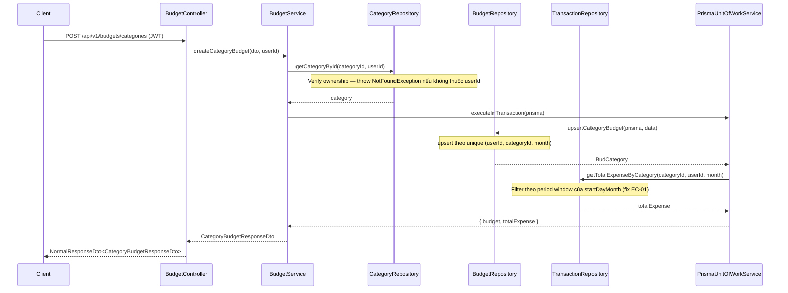
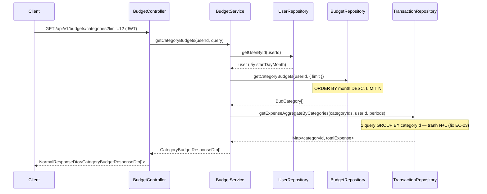

# Technical Design: Budget Improvement

## 1. Sequence Flows

### 1a. Upsert Category/SubCategory Budget (Story 1 — quản lý ngân sách theo startDayMonth)



### 1b. Lấy lịch sử Budget (Story 2 — xem lịch sử ngân sách)



---

## 2. Database Design

### Không cần bảng mới — chỉ thêm index để tối ưu query lịch sử (fix EC-02)

Thêm vào `src/prisma/schema.prisma`:

```prisma
model BudCategory {
  id         String  @id @default(uuid())
  categoryId String  @map("category_id")
  budget     Decimal @db.Decimal(18, 2)
  month      String  // Format: YYYY-MM
  userId     String  @map("user_id")

  user     User     @relation(fields: [userId], references: [id], onDelete: Cascade)
  category Category @relation(fields: [categoryId], references: [id], onDelete: Cascade)

  @@unique([userId, categoryId, month])
  @@index([userId, month])           // THÊM MỚI — tối ưu query lịch sử theo tháng
  @@map("bud_category")
}

model SubBudCategory {
  id            String  @id @default(uuid())
  categoryId    String  @map("category_id")
  subCategoryId String  @map("sub_category_id")
  budget        Decimal @db.Decimal(18, 2)
  month         String  // Format: YYYY-MM
  userId        String  @map("user_id")

  user        User        @relation(fields: [userId], references: [id], onDelete: Cascade)
  category    Category    @relation(fields: [categoryId], references: [id], onDelete: Cascade)
  subCategory SubCategory @relation(fields: [subCategoryId], references: [id], onDelete: Cascade)

  @@unique([userId, subCategoryId, month])
  @@index([userId, month])           // THÊM MỚI — tối ưu query lịch sử theo tháng
  @@map("sub_bud_category")
}
```

> Sau khi sửa schema: `npx prisma migrate dev --name add_budget_month_index` → `npx prisma generate`

---

## 3. Các thay đổi Logic Chính

### 3a. Fix EC-01 — `calculatePeriodForMonth` overflow tháng ngắn

**File:** `src/modules/budget/services/budget.service.ts`

Logic hiện tại bị lỗi khi `startDayMonth = 31` và tháng tiếp theo có ít hơn 31 ngày.
Cần clamp `endDate` về ngày cuối tháng thực tế:

```typescript
// Thay vì:
const endDate = new Date(nextYear, nextMonth, startDayMonth - 1, 23, 59, 59, 999);

// Dùng helper clamp:
const lastDayOfNextMonth = new Date(nextYear, nextMonth + 1, 0).getDate();
const endDay = Math.min(startDayMonth - 1 || lastDayOfNextMonth, lastDayOfNextMonth);
const endDate = new Date(nextYear, nextMonth, endDay, 23, 59, 59, 999);
```

### 3b. Fix EC-03 — Thay N+1 query bằng 1 aggregate query cho lịch sử

**File:** `src/modules/transaction/repositories/transaction.repository.ts`

Thêm method mới:

```typescript
// Trả về Map<categoryId_month, totalExpense> — 1 query thay vì N
async getExpenseAggregateByCategories(
  userId: string,
  filters: { categoryId: string; startDate: Date; endDate: Date }[]
): Promise<Map<string, number>>
```

**File:** `src/modules/budget/services/budget.service.ts`

`getCategoryBudgets` gọi 1 lần aggregate thay vì loop `Promise.all`.

### 3c. Fix EC-04 — DTO validate budget > 0

**File:** `src/common/dto/budget/budget.dto.ts`

```typescript
// Đổi từ @Min(0) thành @Min(1) cho cả 2 DTO:
@Min(1)
budget: number;
```

### 3d. Thêm query param `limit` cho lịch sử

**File:** `src/common/dto/budget/budget.dto.ts`

```typescript
export class BudgetQueryDto {
  @IsOptional()
  @IsString()
  @Matches(/^\d{4}-\d{2}$/)
  month?: string;

  @IsOptional()
  @IsNumber()
  @Min(1)
  @Max(24)
  @Transform(({ value }) => parseInt(value))
  limit?: number; // THÊM MỚI — số tháng lịch sử, default 12
}
```

---

## 4. Module Structure (không đổi, chỉ sửa file hiện có)

```
src/modules/budget/
  controllers/budget.controller.ts    ← không đổi route, chỉ pass limit
  services/budget.service.ts          ← fix EC-01, fix N+1, thêm limit
  repositories/budget.repository.ts   ← thêm ORDER BY + LIMIT cho history query

src/modules/transaction/
  repositories/transaction.repository.ts  ← thêm getExpenseAggregateByCategories()

src/common/dto/budget/budget.dto.ts   ← @Min(1), thêm limit field
src/prisma/schema.prisma              ← thêm @@index
```

---

## 5. Dependencies inject (không thay đổi)

| Dependency | Vai trò |
|---|---|
| `BudgetRepository` | CRUD BudCategory / SubBudCategory |
| `CategoryRepository` | Verify categoryId ownership |
| `SubCategoryRepository` | Verify subCategoryId ownership |
| `TransactionService` | Tính totalExpense (sẽ dùng aggregate method mới) |
| `UserRepository` | Lấy `startDayMonth` của user |
| `PrismaUnitOfWorkService` | Wrap upsert budget + đọc totalExpense trong 1 transaction |

---

## 6. Tasks Summary

- [ ] Thêm `@@index([userId, month])` vào `BudCategory` và `SubBudCategory` trong schema + migrate
- [ ] Fix `@Min(0)` → `@Min(1)` trong `budget.dto.ts`
- [ ] Thêm field `limit` vào `BudgetQueryDto`
- [ ] Fix `calculatePeriodForMonth` clamp endDay cho tháng ngắn
- [ ] Thêm `getExpenseAggregateByCategories()` vào `TransactionRepository`
- [ ] Refactor `getCategoryBudgets` và `getSubCategoryBudgets` dùng aggregate query + limit
